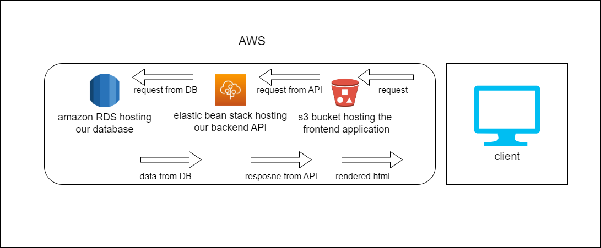

# udagram

### udagram is a fullstack application and it's hosted on AWS

### installation

- `git clone https://github.com/M-Massoud/Udagram.git`

- install AWS CLI
  [follow the steps here](https://docs.aws.amazon.com/cli/latest/userguide/getting-started-install.html)

- install ElasticBeanstalk
  [follow the steps here](https://github.com/aws/aws-elastic-beanstalk-cli-setup)

then follow the documentation

- infrastructure diagram

  

### documentation

- RDS documentaion [here](/udagram/documentation/RDS/RDS-docs.md)

- S3 bucket documentaion [here](/udagram/documentation/S3-bucket/S3-bucket.md)

- ElasticBeanstalk documentaion [here](/udagram/documentation/ElasticBeanstalk/ElasticBeanstalk.md)

- circleci documentaion [here](/udagram/documentation/ElasticBeanstalk/ElasticBeanstalk.md)

environment variables

```
 POSTGRES_USERNAME=
 POSTGRES_PASSWORD=
 POSTGRES_DB=
 POSTGRES_HOST=
 AWS_REGION=
 AWS_PROFILE=
 AWS_BUCKET=
 JWT_SECRET=
 AWS_ACCESS_KEY_ID=
 AWS_SECRET_ACCESS_KEY=
 AWS_DEFAULT_REGION=
```
