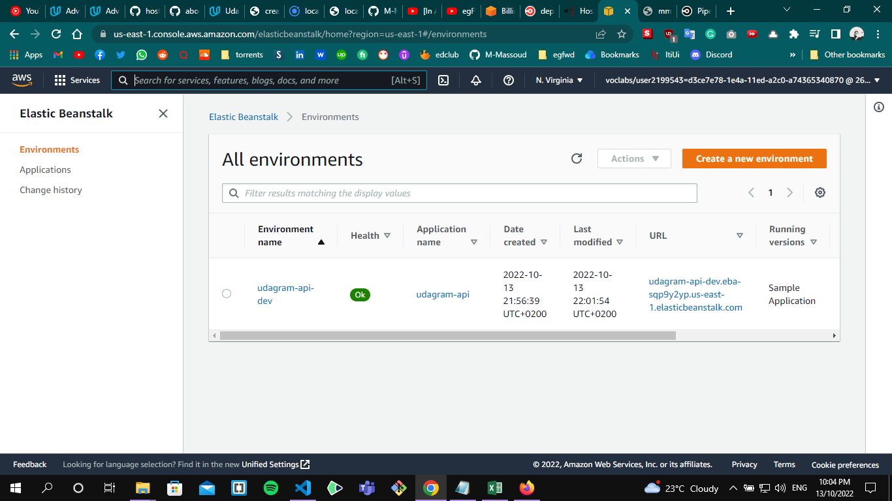
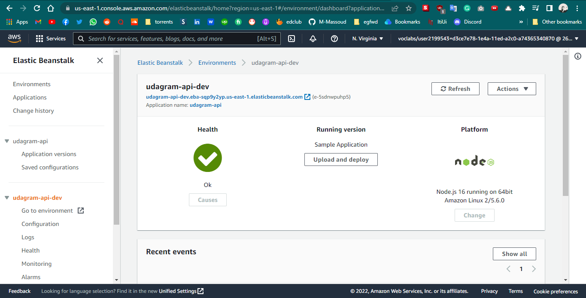
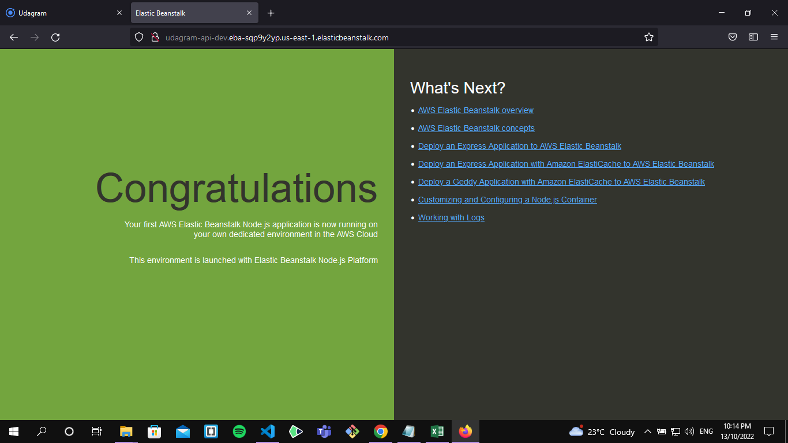
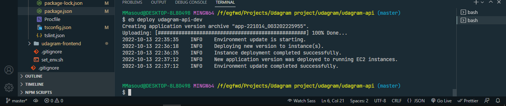
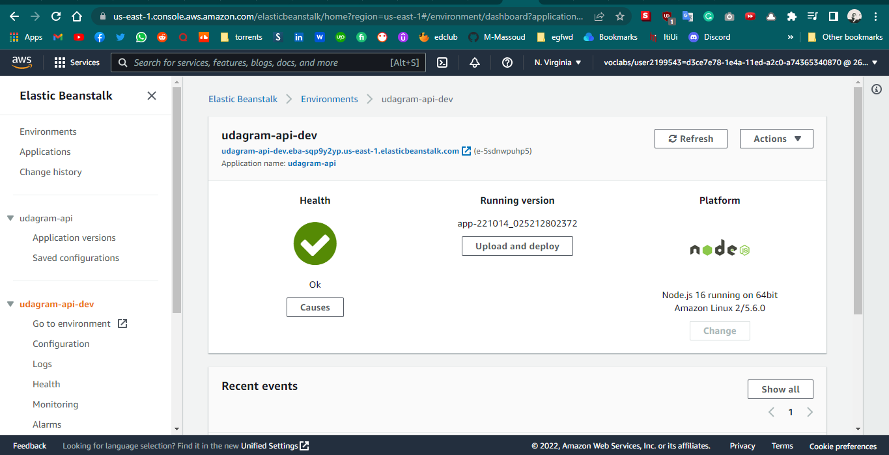

## ElasticBeanstalk

- create a Beanstalk environment: from the terminal run `eb init udagram-api --platfom node.js --region us-east-1`

- create environment sample: run `eb create --sample udagram-api-dev`

- from AWS console search for `eb` and choose `Elastic Beanstalk` you will find the environment we just created

  

  

- the endpoint is working fine

  

- now we need to deploy our project: from your project run `eb use-udagram-api dev` on the terminal

- build the application `npm run build`

- to set the environment variables run `eb setenv <key>=<value>`

- run `eb deploy udagram-api-dev`
  

- then check our environment from the AWS console

  
