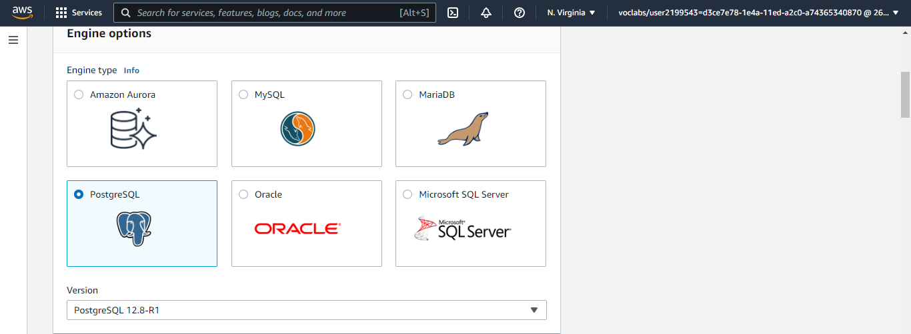
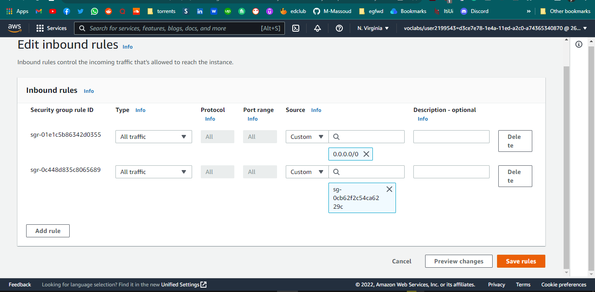

# RDS

## AWS RDS for the database

- login to the account using your credentials

- from RDS choose databases then click create database button

  

- choose standard create

  

- choose postgreSQL and version `12.8-R1`

  

- choose the free tier

  

- then choose the database name and password

  

- then choose the storage to be 20gb and disable the auto scaling

  

- make sure to choose the puplic access option and click create database

- data base created successfully

  

- to be able to connect to the our database we should allow an IP to connect to the database from `Connectivity & Security` tab then select `VPC sercurity groups`

  

- click `Inbound Rules` Then `Edit Inbound Rules`

  

- then add `0.0.0.0/0` and hit save

  

- test the connection to our database

  
