# S3 bucket

- from AWS console search for `s3` then choose `create bucket`

  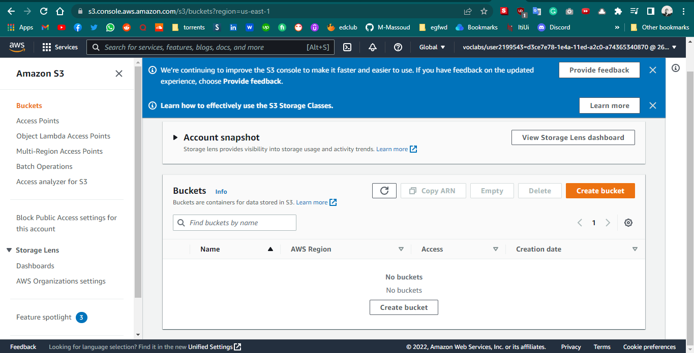

- choose a unique name for your bucket

  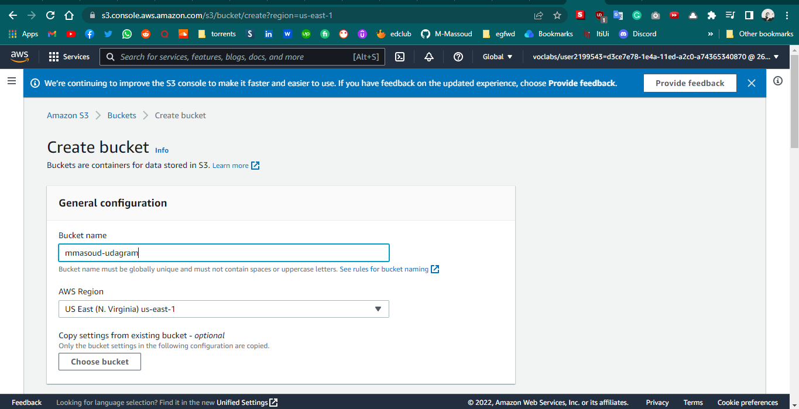

- make sure to uncheck block public access

  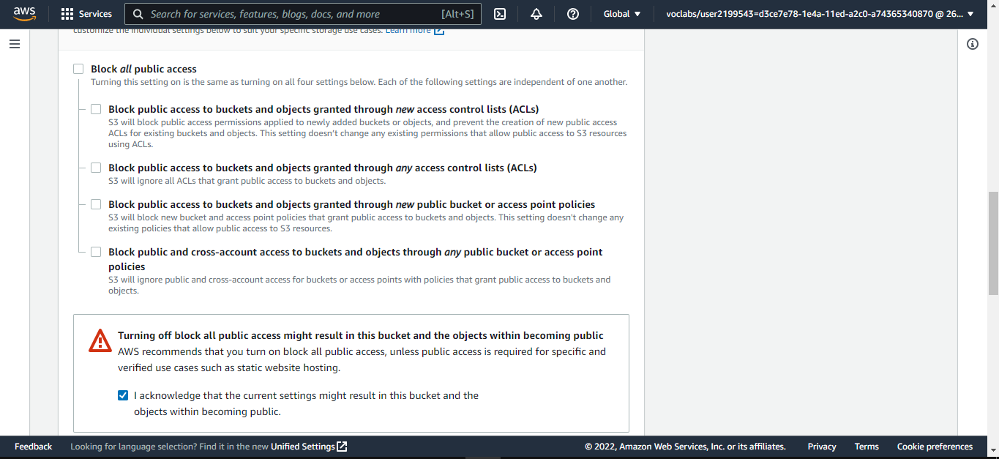

- in the `Default encryption` choose `disable` then create the bucket

  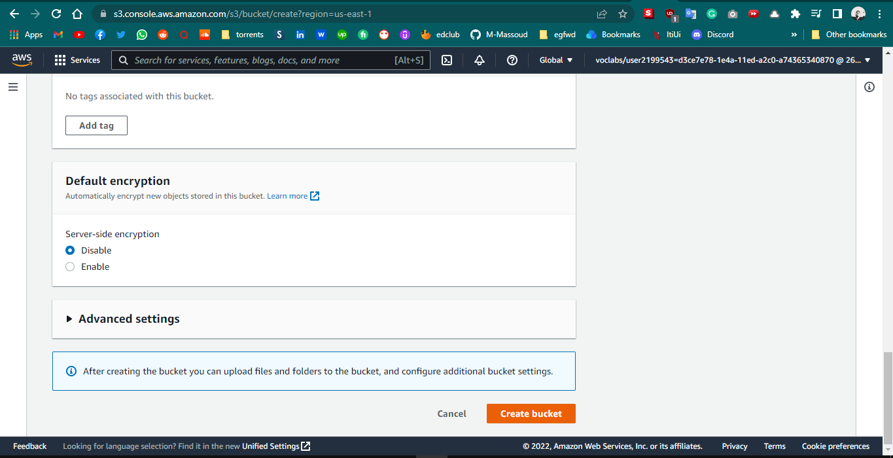

- bucket created successfully

  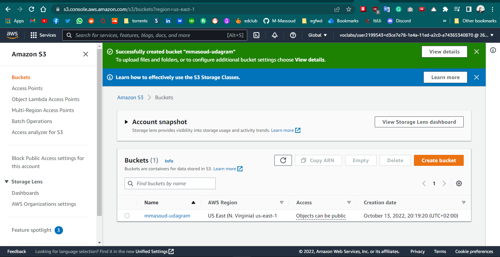

- set bucket policy by choosing `permissions` after choosing your bucket

  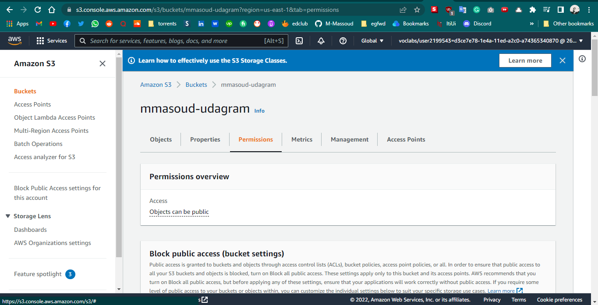

- then click `Edit` and add

```
{
    "Version": "2012-10-17",
    "Statement": [
        {
            "Sid": "PublicReadGetObject",
            "Effect": "Allow",
            "Principal": "*",
            "Action": [
                "s3:GetObject"
            ],
            "Resource": [
                "arn:aws:s3:::mmasoud-udagram/*"
            ]
        }
    ]
}
```

    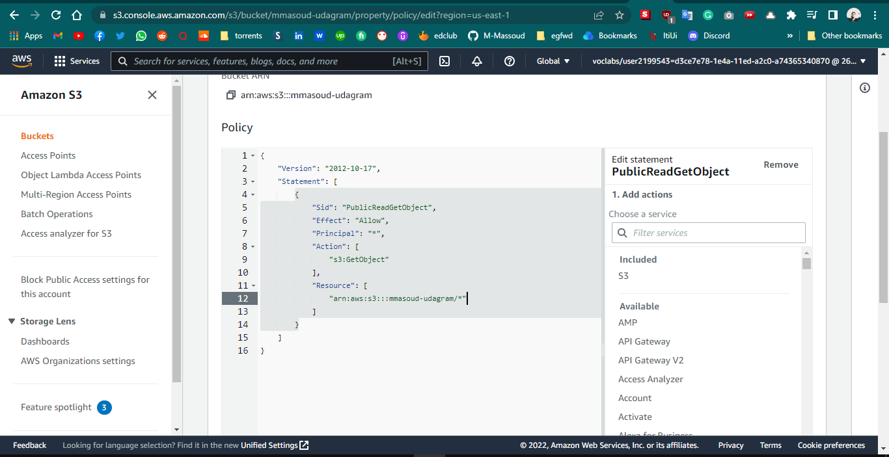

- Configure static website hosting: scroll to `Static website hosting` and click edit

  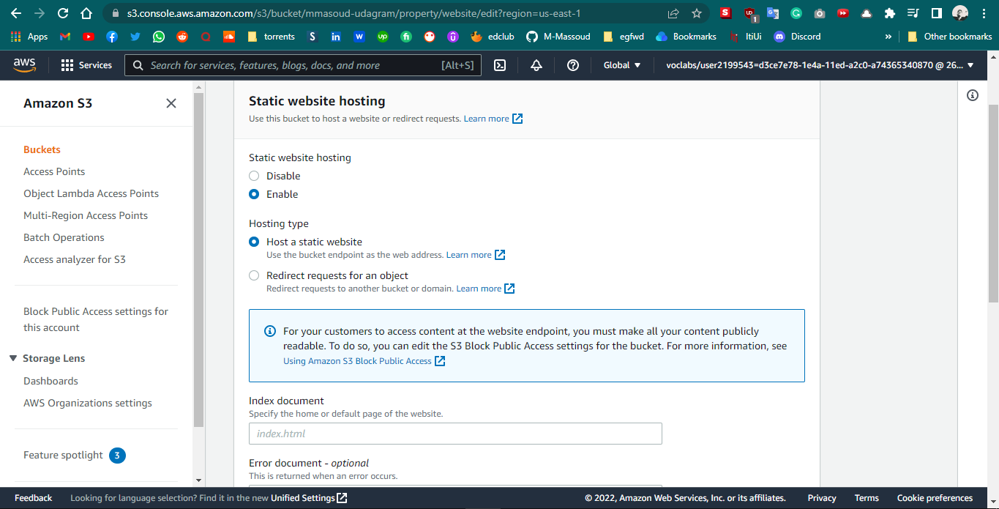

- AWS provide us with the Endpoint

  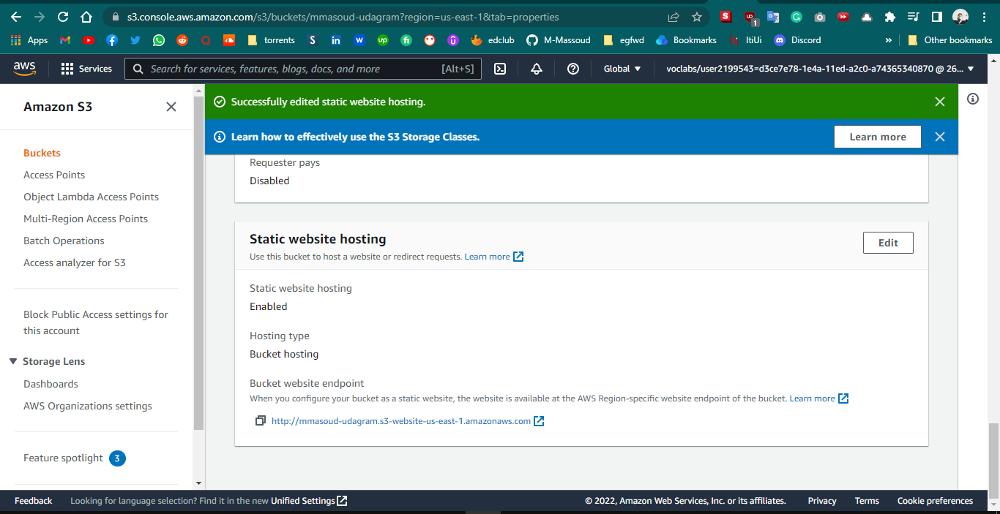

- now we need to upload our files: first let's create a user
  search for `IAM` then from `users groups` click on `create group` give the group a name and attach `AdminstratorAcess` to it

  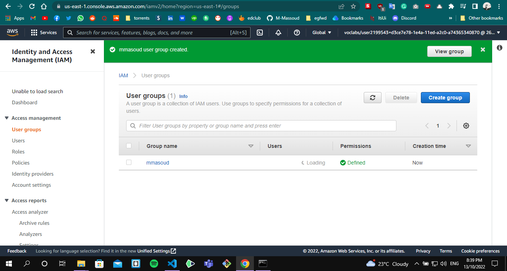

- then click on `users` and click `Add users`

  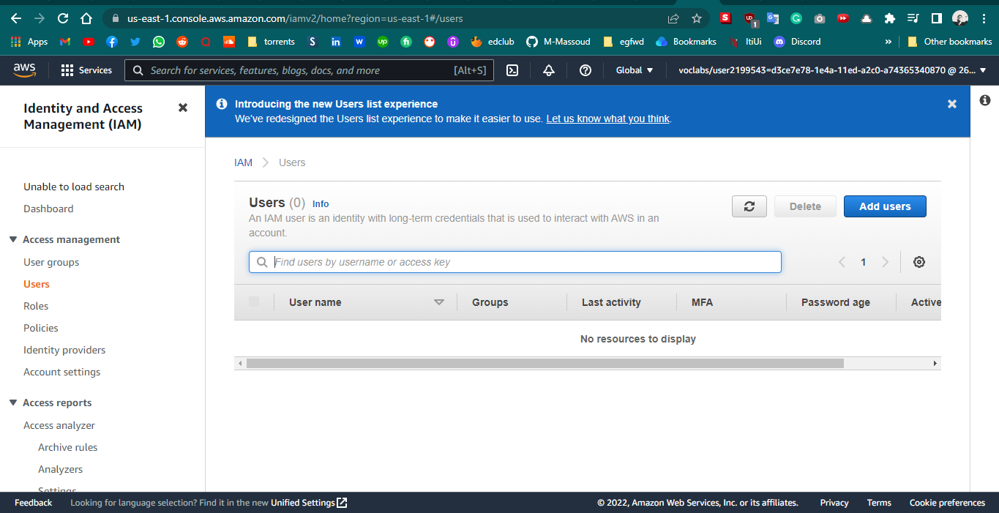

- give your user a name and check `Access Key Programtic Access`

  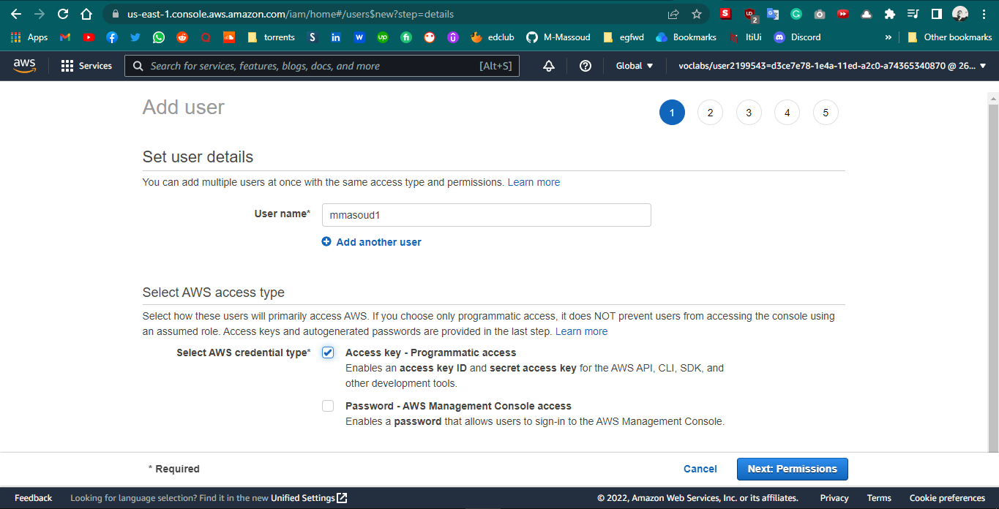

- select your group to attach the user to it then click create user
  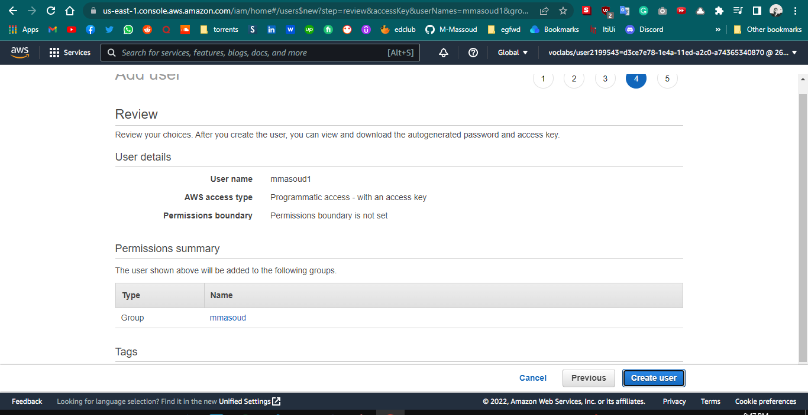

- user created successfully
  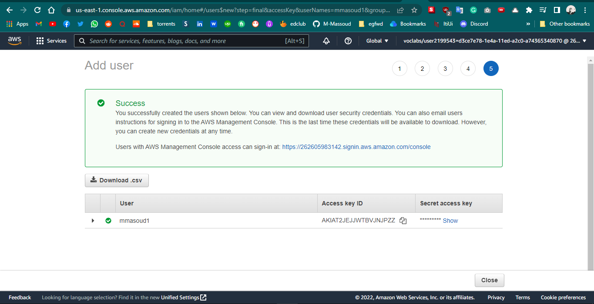

- from the terminal add `aws configure` and add the `AWS ACCESS KEY ID` and `AWS SECRET ACCESS KEY` we have from the last step

- navigate to my project and run this command to upload my files `aws s3 cp --recursive --acl public-read ./www s3://mmasoud-udagram` and now my files uploaded successfully

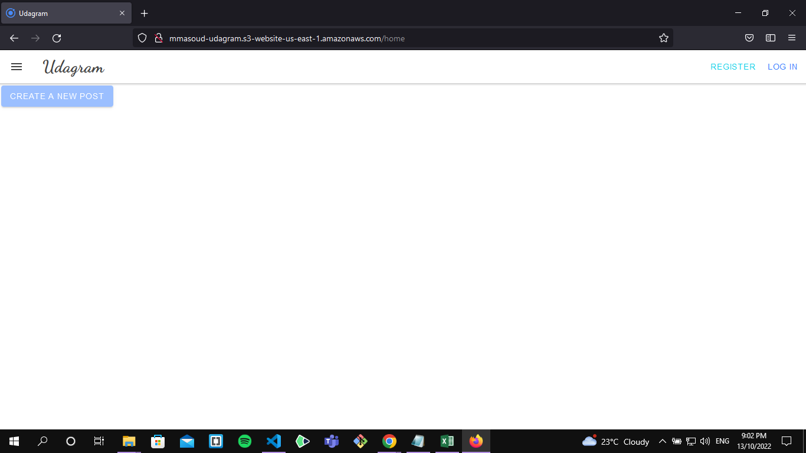

frontend endpoint http://mmasoud-udagram.s3-website-us-east-1.amazonaws.com/
