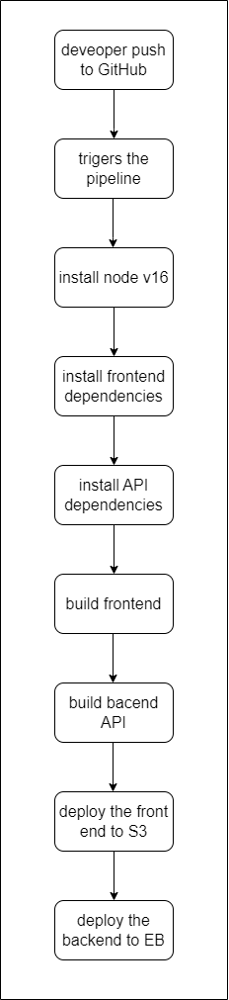
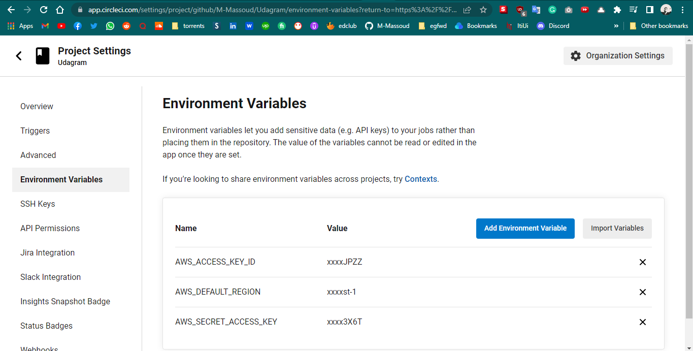
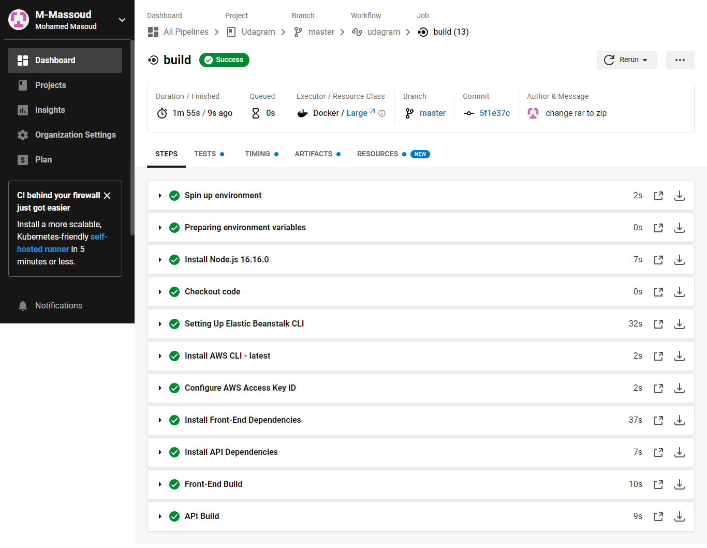

## circle ci documentation

- pipeline diagram

  

- circle ci environment variables from the dashboard select project settings then choose `environment variables`

- then when i push to master branch the circle ci will be trigered and the begin the pipeline

